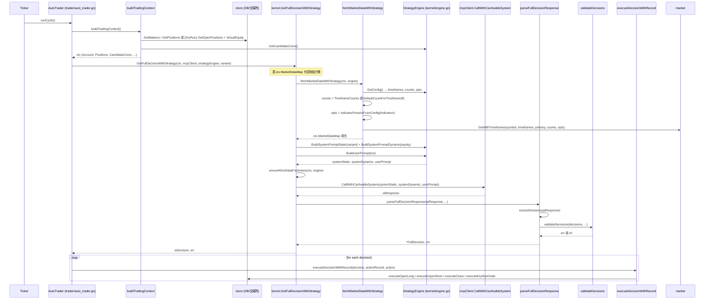

# 从获取行情到执行下单 — 完整工作流与四大核心疑问

本文档基于代码库梳理「行情 → 上下文 → Prompt 组合 → LLM 调用 → 解析校验 → 执行」全链路，并回答：Prompt 组合逻辑、上下文构建、复盘机制、前端配置遵循度；文末给出「浪浪裸 K 法」需修改的核心文件与内置 Prompt 调整建议。

---

## 时序图：从行情到下单

---

## 1. Prompt 组合逻辑

### 1.1 组合方式与优先级

- **系统提示词** = **System Prompt Static**（可缓存）+ **System Prompt Dynamic**（每请求必发，含当前权益与仓位价值上限）。
- **策略可编辑块**：来自 `StrategyConfig.PromptSections`（及策略语言），**直接替换**默认段落，而不是“追加”；若某段为空则使用引擎内置默认文案。
- **CustomPrompt**：策略里的 `CustomPrompt` 在 **BuildSystemPromptStatic** 末尾、Output Format 之前写入，并注明“不得违反基本风控”。

**核心文件**  
- `kernel/engine.go`：`BuildSystemPromptStatic(variant)`、`BuildSystemPromptDynamic(accountEquity)`  
- `store/strategy.go`：`StrategyConfig.PromptSections`、`CustomPrompt`

### 1.2 内置结构顺序（Static）

1. **Role definition**：`promptSections.RoleDefinition` 非空则用，否则默认 “You are a professional cryptocurrency trading AI”。
2. **Trading mode variant**：aggressive / conservative / scalping 等（由 `variant` 决定）。
3. **Hard constraints**：CODE ENFORCED（最大持仓数、仓位价值比例、最大保证金比例、最小仓位等）+ AI GUIDED（杠杆、风险收益比、最低置信度）。
4. **Trading frequency**：`promptSections.TradingFrequency` 或默认“2–4 笔/天、单笔持仓 ≥30–60 分钟”等。
5. **Entry standards**：`promptSections.EntryStandards` 或默认“多信号共振、置信度≥MinConfidence”；无论哪种都会接 **writeAvailableIndicators(&sb)** 列出的“你有的数据”（仅列清单，不强制维度）。
6. **Decision process**：`promptSections.DecisionProcess` 或默认“先看持仓 → 扫候选币多周期 → 先 CoT 再 JSON”。
7. **SYSTEM OVERRIDE**：CRITICAL_SYSTEM_RULES（是否允许 AI 主动 close_long/close_short）、TRAILING_STOP_PROTOCOL、**Output Format**（`<reasoning>` / `<decision>`、JSON 数组格式与字段说明）— **此处为硬编码，不可被策略覆盖**。
8. **CustomPrompt**（若有）：`# 📌 Personalized Trading Strategy` + 策略内 CustomPrompt。
9. **Schema**：JSON 字段说明（与 Output Format 一致）。

结论：  
- **权重上**：SYSTEM OVERRIDE 与 Output Format 始终在最后且不可被策略覆盖，**优先级最高**。  
- **分析维度**：系统没有“强制必须使用某指标”的硬逻辑，只是通过 **Entry Standards 默认文案 + writeAvailableIndicators 列表** 建议“多信号、你有的数据”；若策略里把 EntryStandards 改成裸 K 逻辑，并关闭所有指标，就不会再强调指标维度。

---

## 2. 上下文构建流程

### 2.1 谁在何时拉 K 线、拉多少根

- **入口**：`GetFullDecisionWithStrategy` 内，若 `len(ctx.MarketDataMap)==0` 则调 `fetchMarketDataWithStrategy(ctx, engine)`。  
- **时间周期与根数**：  
  - `timeframes` / `primaryTimeframe` 来自 `engine.config.Indicators.Klines`（SelectedTimeframes、PrimaryTimeframe、LongerTimeframe 等）。  
  - 每个周期根数：优先 `config.Indicators.Klines.TimeframeCounts[tf]`，若未配置则用 **market.DefaultCountForTimeframe(tf)**。

**DefaultCountForTimeframe 示例**（`market/data.go`）：  
- 1m→200, 3m→150, 5m→100, 15m→50, 30m→40, 1h→30, 4h→20, 1d→10 等。

### 2.2 是否“私自”抓技术指标

- **不会脱离策略配置多抓一层指标**。  
- 拉行情时传入的 `opts` 来自 **IndicatorParamsFromConfig(engine.config.Indicators)**（`kernel/engine.go`）：只有策略里 `Enable*` 为 true 的指标才会被填入 `opts`，进而由 `market.GetWithTimeframes(..., opts)` 计算。  
- User Prompt 里每个币种的数据由 **formatMarketData** 输出：仅当 `indicators.Enable*` 为 true 时才会写入对应 EMA/RSI/MACD/ATR/BOLL/Volume/OI/Funding 等；K 线 OHLCV 始终存在。

**核心文件**  
- `kernel/engine.go`：`fetchMarketDataWithStrategy`、`IndicatorParamsFromConfig`、`formatMarketData`、`formatTimeframeSeriesData`  
- `market/data.go`：`DefaultCountForTimeframe`、`GetWithTimeframes` / `GetWithTimeframesWithExchange`

结论：  
- K 线根数由 **前端/策略配置的 TimeframeCounts** 或 **DefaultCountForTimeframe** 决定。  
- 技术指标**严格按策略 Indicators 开关**，无额外私自抓取；做裸 K 时关闭所有 Enable* 即可只给 OHLCV。

---

## 3. “复盘（Reflection）”机制深度解析

### 3.1 是否存在“决策回溯 / 自我修正”模块

- 代码中**没有**名为 “reflection” 或“复盘”的独立模块，也没有基于“历史决策 vs 实际结果”的自动修正或二次推理链路。  
- 与“历史”相关的只有：**把历史成交与统计写入当轮 User Prompt**，供模型**当轮**参考，而不是事后对决策做校验或改单。

### 3.2 历史数据如何进入 Prompt

- **RecentOrders**：最近约 10 笔已平仓记录（`store.Position().GetRecentTrades(at.id, 10)`），在 `buildTradingContext` 里写入 `ctx.RecentOrders`，在 **BuildUserPrompt** 中格式化为 “Recent Completed Trades”。  
- **TradingStats**：`store.Position().GetFullStats(at.id)`（总笔数、胜率、盈亏比、夏普、总盈亏、平均盈亏、最大回撤等），在 BuildUserPrompt 中格式化为 “历史交易统计”，并根据盈利因子/夏普/回撤给出“表现良好 / 需改进 / 风险偏高”等**提示语**。

**核心文件**  
- `trader/auto_trader.go`：`buildTradingContext` / `buildDryRunTradingContext` 中调用 GetRecentTrades、GetFullStats，填充 `ctx.RecentOrders`、`ctx.TradingStats`  
- `kernel/engine.go`：`BuildUserPrompt` 中 “Recent Completed Trades”“历史交易统计” 两段

### 3.3 裸 K 与“复盘”的关系

- “复盘”输入 = **历史成交记录 + 汇总统计**，**不依赖任何技术指标**。  
- 因此：**裸 K 交易不会因为缺少指标而在复盘/历史统计处产生幻觉或报错**；只要策略里关闭了所有指标，User Prompt 里就不会出现指标数据，历史块仍正常显示。

---

## 4. 前端配置遵循度与执行器硬性过滤

### 4.1 解析与校验流程

- **解析**：`parseFullDecisionResponse` → `extractDecisions`（从 `<decision>` 或 JSON 数组提取）→ 若完全找不到 JSON 则返回安全 fallback：`[{ "symbol":"ALL", "action":"wait", "reasoning":"..." }]`。  
- **校验**：`validateDecisions` → 对每条 `validateDecision`。**校验失败会直接返回 err**，整轮决策被视为失败（不会部分执行）。

### 4.2 开仓时的“硬性”要求（会拒绝或修正）

- **action**：必须在 `open_long` / `open_short` / `hold` / `wait` / `close_long` / `close_short` 之一。  
- **open_long / open_short 时**：  
  - `leverage` 必须 > 0，且不超过策略配置的 BTC/ETH 或 Altcoin 上限（超则自动压到上限）。  
  - `position_size_usd` 必须 > 0，且满足最小仓位（BTC/ETH ≥60 USDT，其它 ≥12 USDT），且不超过“权益×配置比例”。  
  - **若未启用 ATR 追踪**（即 `useATRTrailing == false`）：  
    - 必须 `stop_loss > 0`；  
    - 必须提供 **take_profit** 或 **take_profit_stages**（且若策略未开启分批止盈，则禁止 take_profit_stages / atr_tp_stages）；  
    - 多空方向与 SL/TP 大小关系校验（例如 long 时 SL < TP）。  
  - **若启用 ATR**：用 atr_sl_mult、atr_tp_mult 或 atr_tp_stages，无静态 stop_loss/take_profit 的强制要求。

**核心文件**  
- `kernel/engine.go`：`parseFullDecisionResponse`、`extractDecisions`、`validateDecisions`、`validateDecision`

### 4.3 是否会因“缺系统默认字段”拒绝下单

- **会**。开仓时缺少 **leverage**、**position_size_usd**，或（非 ATR 模式下）缺少 **stop_loss** 或 **take_profit/take_profit_stages**，**validateDecision 会返回错误**，导致整轮解析失败、不执行任何下单。  
- 系统**不会**在解析阶段给 LLM 输出“补默认值”（例如自动填 leverage）；只会对 **leverage 超上限** 做自动压限，其它缺字段一律报错。

---

## 5. 实现“浪浪裸 K 法”需动到的核心文件与内置 Prompt

目标：只使用 K 线 OHLCV，不用任何技术指标；系统不强调“多指标共振”，不强制模型依赖指标。

### 5.1 策略配置（前端 / DB）

- **Indicators**：关闭所有 Enable*（EnableEMA、EnableRSI、EnableMACD、EnableATR、EnableBOLL、EnableVolume、EnableOI、EnableFundingRate、EnableQuantData、EnableOIRanking、EnableNetFlowRanking、EnablePriceRanking 等），这样：  
  - `IndicatorParamsFromConfig` 不会请求指标计算；  
  - `writeAvailableIndicators` 只会列出主周期（及若有多周期则 LongerTimeframe）的 “price series”；  
  - `formatMarketData` 只输出 OHLCV 表，不输出任何指标。  
- **Klines**：按需保留 PrimaryTimeframe、SelectedTimeframes、TimeframeCounts（或用默认根数），无需改代码。

### 5.2 需要修改或覆盖的内置 Prompt（核心文件）

以下均在 **kernel/engine.go** 的 **BuildSystemPromptStatic** 中：

| 位置 | 内容 | 建议 |
|------|------|------|
| **Role definition** | 默认 “You are a professional cryptocurrency trading AI” | 可在策略 **PromptSections.RoleDefinition** 中覆盖为裸 K 角色（例如强调仅依据价格与量、K 线形态，禁止依赖指标）。 |
| **Entry standards** | 默认 “Only open when multiple signals resonate” + writeAvailableIndicators 列表 | **必须**在策略 **PromptSections.EntryStandards** 中覆盖：写明“仅依据 K 线（OHLCV）与形态/结构，不使用任何技术指标”；此时 writeAvailableIndicators 仍会追加一段“你有的数据”，但关闭指标后仅为 “- {primaryTimeframe} price series” 等，可接受。 |
| **Decision process** | 默认 “1. Check positions 2. Scan candidate coins + multi-timeframe 3. CoT then JSON” | 建议在 **PromptSections.DecisionProcess** 中改为裸 K 的思考顺序（例如：结构/趋势 → 关键 K 线/形态 → 再决定是否开平）。 |
| **Output Format / SYSTEM OVERRIDE** | 硬编码：`<reasoning>` / `<decision>`、JSON 字段、CRITICAL_SYSTEM_RULES 等 | **不能**通过策略覆盖；保持即可。开仓仍须带 leverage、position_size_usd、stop_loss、take_profit（或 ATR 相关字段）。 |

### 5.3 可选：减少“多信号共振”的默认话术（改引擎默认）

若希望**未配置 EntryStandards 时**也弱化“多指标共振”，可改 **kernel/engine.go** 中 **BuildSystemPromptStatic** 的默认分支（约 1142–1153 行）：

- 当前 else 分支会写 “Only open positions when multiple signals resonate” 并调用 `e.writeAvailableIndicators(&sb)`。  
- 可改为：当检测到**所有指标均为关闭**时，输出一句中性说明（例如 “You have only OHLCV time series; use price action and structure at your discretion.”），而不再写 “multiple signals resonate”。  
- 这样即使用户未填 EntryStandards，裸 K 策略也不会被默认文案强行带到“多指标”。

### 5.4 不需要改动的部分

- **复盘/历史**：仅用成交记录与统计，与指标无关；裸 K 无需改。  
- **validateDecision**：仍要求 leverage、position_size_usd、stop_loss、take_profit（或 ATR）；裸 K 只是“分析方式”不同，**输出格式与风控字段仍须满足**，否则会被拒绝下单。  
- **fetchMarketDataWithStrategy / IndicatorParamsFromConfig**：只要策略关闭所有指标，就不会请求或展示指标，无需改代码。

### 5.5 裸 K 小结

- **必须做的**：策略里关闭所有 Indicators 的 Enable*；在策略 **PromptSections** 中覆盖 **EntryStandards**（及建议 **RoleDefinition**、**DecisionProcess**），明确“仅用 K 线与形态”。  
- **可选做的**：在 **kernel/engine.go** 的 BuildSystemPromptStatic 中，当检测到全为裸 K（无任何指标开启）时，将默认 Entry 文案改为不强调“多信号共振”的版本。  
- **不能做的**：不能删减 SYSTEM OVERRIDE 与 Output Format 的硬编码；开仓 JSON 仍须包含系统要求的字段，否则会被 **validateDecision** 拒绝。

---

## 核心文件路径速查

| 环节 | 核心文件 |
|------|----------|
| 周期与下单入口 | `trader/auto_trader.go`（runCycle, buildTradingContext, executeDecisionWithRecord） |
| 行情拉取与 K 线根数 | `kernel/engine.go`（fetchMarketDataWithStrategy）；`market/data.go`（DefaultCountForTimeframe, GetWithTimeframes） |
| 指标是否计算 | `kernel/engine.go`（IndicatorParamsFromConfig）；策略 Config.Indicators |
| System Prompt 组合 | `kernel/engine.go`（BuildSystemPromptStatic, BuildSystemPromptDynamic, writeAvailableIndicators） |
| User Prompt 与历史 | `kernel/engine.go`（BuildUserPrompt, formatMarketData）；context 来自 auto_trader.buildTradingContext |
| 策略可编辑块 | `store/strategy.go`（PromptSectionsConfig, CustomPrompt） |
| AI 调用与解析 | `kernel/engine.go`（GetFullDecisionWithStrategy, parseFullDecisionResponse, extractDecisions, validateDecisions, validateDecision） |
| 执行层 | `trader/auto_trader.go`（executeOpenLongWithRecord, executeOpenShortWithRecord, executeClose*）；Dry-Run：`trader/dry_run_engine.go` |

以上即为从获取行情到执行下单的完整工作流，以及四大疑问的答案与“浪浪裸 K 法”所需修改的核心文件与内置 Prompt 说明。
